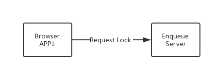
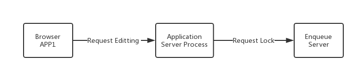

# enqueue-server
Node enqueue server is a clean NodeJS implementation for providing locking and concurrency controls on business object level.
It supports 4 types of locks:

1. Shared lock
2. Exclusive Lock
3. Exclusive but not cumulative Lock
4. Optimistic Lock

## Example
User A is editing a product master data, while user B also attempts to edit the same product. 
On the UI of product mater data maintenance, B is told that the product is currently locked by A, 
and he can only display it. This is a very usual case of pessimistic lock, 
and it can be easily achieved using enqueue-server's exclusive lock.

```javascript
var lockClient = require('enqueue-client');
var lock = {"name":"product","argument":["Computer"],"mode":"E","owner":"B"};

lockClient.lock(lock, function(lockUUID,RC,OWNER){
   if(RC === '0'){ //Lock is acquired
     //Allow Editing
   }else{
     //Report message: "The product Computer is now locked by <OWNER>"
   }  
});
```

## Architecture and Deployment
Enqueue server can be deployed in 2 ways: 1) Accessed by browser APP; 2) Accessed by a server process. 

### Accessed by a Browser APP



By embedding the [enqueue-client](https://www.npmjs.com/package/enqueue-client), 
you can request locks directly from a browser app. 
Although a user can use browser javascript debugger to jump over the control, 
but it somehow provides simplification on implementing the enqueue logic. 
You can use enqueue server in this way for running tests. 

### Accessed by a Server Process



It is recommended to use enqueue server in this way, as it is much safer and can also benefits performance and throughput.
 
## To Begin
1. Install it:

   ```bash
   $ npm install -g enqueue-server 
   ```
 
2. Start the enqueue server:

   CD to the install path of EnqueueServer

   ```bash
   $ node index.js 
   ``` 

3. Test to connect:   

    Download the [enqueue-client](https://www.npmjs.com/package/enqueue-client), 
    and execute following javascript in either browser or NodeJS.
    
    ```javascript
    var lockClient = require('enqueue-client');
    lockClient.setEnqueueServerConnection('127.0.0.1', 3721);
    
    var lock = {"name":"product","argument":["Computer"],"mode":"E","owner":"B"};
    lockClient.lock(lock, function(lockUUID,RC,OWNER){
       console.log('Lock is acquired with lock UUID: '+lockUUID);
    });
    ```
## Lock Types
4 lock types are supported.

### Shared Lock (S)
Several users (transactions) can access locked data at the same time in display mode. 
Requests from further shared locks are accepted, even if they are from different users.

An exclusive lock (E) set by another user on an object that already has a shared lock will be rejected. 
Every extended exclusive lock (X) will also be rejected.

### Exclusive Locks (E)
An exclusive lock protects the locked object against all types of locks from other transactions. 
Only the same lock owner can reset the lock (accumulate).

### eXclusive non-cumulative (X)
Whereas exclusive locks can be requested several times by the same transaction and released one by one, 
an exclusive, non-cumulative lock can only be requested once by the same transaction. 
Each further lock request will be rejected.

### Optimistic Lock (O)
Optimistic locks initially behave like shared locks and can be converted into exclusive locks.

## Elementary Lock
An elementary lock contains following attributes:

**name**: lock object name, usually you can use the database table name.

**argument**: the key of the object, it is an array, 
as the object key may be combined with several fields. 
For example, an object has the key combined with 3 fields.
The argument ['A', 'B', '@'] stands for the object with first 2 key fields equals 'A' and 'B',
the wildcard letter represented here by '@'.

**mode**: 4 lock types: S, E, X, O.

**owner**: the owner who holds the lock, it can be a login user ID.

**waitTime**: time to wait until the lock is acquired, default is 0.

**timeout**: time to hold the lock, default is 15 minutes.

## Tests
You can find all the unit tests in the _test_ folder, and run them by:

   ```bash
   $ npm run test 
   ``` 

## Performance
Performance is tested to support around 3000 lock/unlock requests per second.

## License
[The MIT License](http://opensource.org/licenses/MIT)